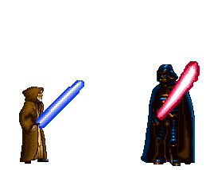

#  Hi, my name is **Juliano**!

 

## About Me
💡 &nbsp; I like to explore new technologies and develop software solutions and quick hacks. \
🎓 &nbsp; I am currently studying Computer Science at the Federal University of Santa Maria. \
🌱 &nbsp; I'm learning more about artificial intelligence, systems design and cloud architecture. \
✍️ &nbsp; In my free time I study new technologies and share news on my social networks / I also do some side activities like weight training and nature walks \
💬 &nbsp; Feel free to contact me for advice and tips or just an interesting discussion. \
✉️ &nbsp; You can send an email to julianoleonardosoares@hotmail.com! I will try to answer as soon as I can. \

 🎓 Education

- University graduate:
   - Bachelor's Degree in Computer Science from the Federal University of Santa Maria.

- Languages:
   - Basic English.
   - Basic Spanish.
   - Native Portuguese. 
  

📃 Courses and Certificates

- [My courses and Certificates ](https://julianoleonardosoares.com/certificates)

🖥️ Experiences

- 👨‍💻 **Software development intern and researcher in the field of artificial intelligence**\
  - 📆 2020 - moment\
  - 📍 **SISASTROS** - Santa Maria/RS, Brazil\
 &nbsp;
 &nbsp;

- 👨‍💻 **Software development intern**\
  - 📆 2019 - 2020\
  - 📍 **Meta** - Recanto do Maestro/RS, Brazil\
&nbsp;
&nbsp;
&nbsp;
&nbsp;
&nbsp;
&nbsp;

---

##   Tecnologias

&nbsp;
&nbsp;
&nbsp;
&nbsp;
&nbsp;
&nbsp;
&nbsp;
&nbsp;
&nbsp;
&nbsp;
&nbsp;
&nbsp;
&nbsp;
&nbsp;
&nbsp;
&nbsp;
&nbsp;
&nbsp;
&nbsp;
&nbsp;
&nbsp;
&nbsp;

##  &nbsp;GitHub Analytics

##  &nbsp;Connect with Me

  
  
  
  
  
  
  
  

